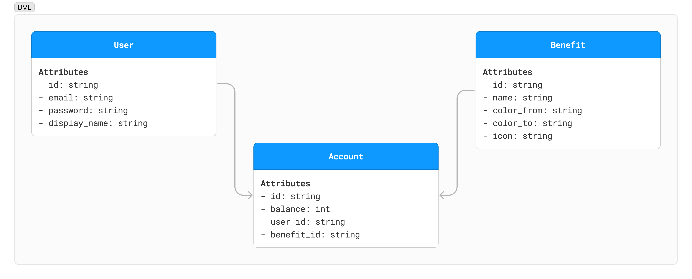
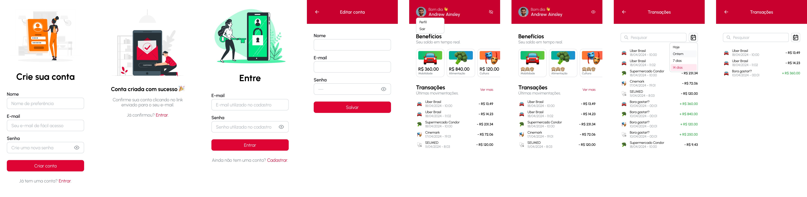

<p align="center">
  <span style="font-size: 100px">🎉</span>
  <h1 align="center">BenefitEase</h1>
  <p align="center">
    ✨ <a href="https://benefit-ease-web.vercel.app">https://benefit-ease.app</a> ✨
    <br/>
    Aplicação hipotética para gerenciamento de benefícios de emprego.
  </p>
</p>
<p align="center">
<a href="https://github.com/alanpinhel/benefit-ease/actions/workflows/build.yml?query=branch%3Amain"></a>
<a href="https://github.com/alanpinhel/benefit-ease/actions/workflows/test.yml?query=branch%3Amain"></a>

## Sumário

- [Sumário](#sumário)
- [Introdução](#introdução)
- [Instalação](#instalação)
  - [Pré-requisitos](#pré-requisitos)
  - [Dependências](#dependências)
- [Uso básico](#uso-básico)
- [Qualidade de Código](#qualidade-de-código)
- [Uso Específico](#uso-específico)
- [Visão Geral](#visão-geral)
  - [apps/web](#appsweb)
  - [apps/admin](#appsadmin)
  - [packages/\*](#packages)
- [Modelagem](#modelagem)
- [Protótipo](#protótipo)

## Introdução

Este projeto representa uma oportunidade para compartilhar minha experiência no desenvolvimento de software, com foco principal no front-end, além de explorar e experimentar novas abordagens, ferramentas e técnicas.

A aplicação simula um cenário hipotético envolvendo o gerenciamento de benefícios de emprego.

Para o backend, estou utilizando [Supabase](https://supabase.com/). A base da stack é composta por [Next.JS](https://nextjs.org/) e [Mantine](https://mantine.dev/).

Além disso, optei por uma estrutura de monorepo, integrando Github Actions para CI/CD e aproveitando a integração com a Vercel.

Ao longo do tempo, planejo implementar testes A/B, feature flags, funcionalidades em tempo real, observabilidade, rastreamento e micro frontends.

## Instalação

### Pré-requisitos

Antes de prosseguir com a instalação, verifique se os seguintes itens estão devidamente instalados em seu sistema:

- [Node.js](https://nodejs.org/)
- [NPM](https://www.npmjs.com/)
- [PNPM](https://pnpm.io/)

Certifique-se de utilizar as versões específicas indicadas no arquivo [`package.json`](package.json#L4-L6).

### Dependências

```sh
pnpm install
```

Este comando instalará as dependências para todas as aplicações e pacotes do projeto. Se desejar filtrar a instalação para um aplicativo específico ou pacote, você pode fazê-lo fornecendo o nome definido no package.json como argumento adicional. Por exemplo:

```sh
pnpm --filter web install
```

Isso instalará as dependências apenas para o aplicativo localizado no diretório `apps/web`.

## Uso Básico

Para executar todas as aplicações em modo de desenvolvimento:

```sh
pnpm dev
```

## Qualidade de Código

Para formatar o código em todo o repositório:

```sh
pnpm format
```

Para verificar problemas de lint em todas as aplicações e pacotes:

```sh
pnpm lint
```

Para executar todos os testes existentes no repositório:

```sh
pnpm test
```

## Uso Específico

Para executar os testes de uma aplicação específica enquanto realiza modificações:

```sh
pnpm --filter web test:watch
```

Para construir e iniciar uma aplicação específica em modo de produção:

```sh
pnpm --filter admin build
pnpm --filter admin start
```

## Visão Geral

Este projeto está estruturado nos seguintes diretórios:

### `apps/web`

Neste diretório está a aplicação voltada para a perspectiva do usuário dos benefícios. Aqui, é possível:

- Criar uma conta de usuário.
- Realizar login.
- Atualizar informações da conta.
- Visualizar o extrato de transações.

### `apps/admin`

Este diretório abriga a aplicação destinada à visão administrativa dos benefícios. Aqui, é possível:

- Cadastrar novos benefícios.
- Registrar contas de benefício.
- Registrar transações.

### `packages/*`

Os pacotes são concebidos para serem simples e devem ser utilizados somente quando um módulo é compartilhado por duas ou mais aplicações.

## Modelagem



Você pode consultar a versão atualizada do diagrama [aqui](https://www.figma.com/file/hqGPsRjxpCAvTNLdSfaGFt/UML?type=whiteboard&node-id=1053-156&t=miBJPy8y5hVFykfh-11).

## Protótipo



Você pode consultar a versão atualizada do protótipo [aqui](https://www.figma.com/file/duXHOBWw2uaRA2Va27TpDz/WebApp?type=design&node-id=3301-343&mode=design).

## Gestão


Você pode consultar a versão atualizada do projeto [aqui](https://github.com/users/alanpinhel/projects/2).
